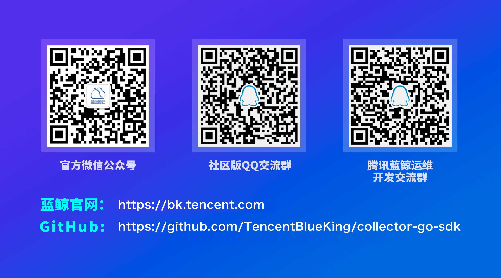

# 采集器框架2.0

蓝鲸采集器框架是基于 libbeat 开源框架基础上的二次开发，主要对主机，互联网设备，服务应用等进行数据采集、上报的组件。例如采集主机/容器的数据，包括系统基础性能、应用服务、数据库、日志等，通过蓝鲸管控平台 (GSE) 的数据管道，将数据传输到蓝鲸数据平台，进行分析计算，监控及告警等。此外，蓝鲸采集器框架还支持**配置热重载**、**PID文件**、**本地存储**、**数据质量监控**、**资源占用监控**、**运营数据上报**等功能。

## Getting Started

你可以在本项目的 [./docs/](docs) 目录下获取到详细的文档，它们包括：

- [采集器框架2.0使用文档](docs/%E9%87%87%E9%9B%86%E5%99%A8%E6%A1%86%E6%9E%B6%E4%BD%BF%E7%94%A8%E6%96%87%E6%A1%A3.md)
- [采集器框架升级指引（1.x -> 2.0）](docs/%E9%87%87%E9%9B%86%E5%99%A8%E6%A1%86%E6%9E%B6%E5%8D%87%E7%BA%A7%E6%8C%87%E5%BC%95.md)
- [采集器框架2.0测试报告](docs/%E6%B5%8B%E8%AF%95%E6%8A%A5%E5%91%8A.md)
- [社区贡献指引](docs/社区贡献.md)

**Note: 需要注意的点**

collector-go-sdk 依赖了我们自己基于 elastic/beats 改造后的 beats 版本，代码位于 [TencentBlueKing/beats](https://github.com/TencentBlueKing/beats)，gomod 依赖引入时请使用 replace 语法替换为

```
require github.com/elastic/beats v7.1.1+incompatible
replace github.com/elastic/beats v7.1.1+incompatible => https://github.com/TencentBlueKing/beats.git v7.1.4-bk
```

## Contributing

我们诚挚地邀请你参与共建蓝鲸采集器框架开源社区，通过提 bug、提特性需求以及贡献代码等方式，一起让采集器框架变得更好。

有关参与采集器框架社区贡献的相关内容，请阅 [Contributing Guide](docs/社区贡献.md)

或者也可以加入我们的开发群



## Community Beats

如果你开发了新的采集器，欢迎贡献你的采集器，并通过 issue 通知我们更新以下社区采集器子项目列表。

## License

基于 MIT 协议，详细请参考 [LICENSE](./LICENSE)
