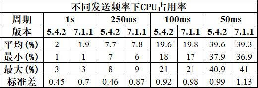
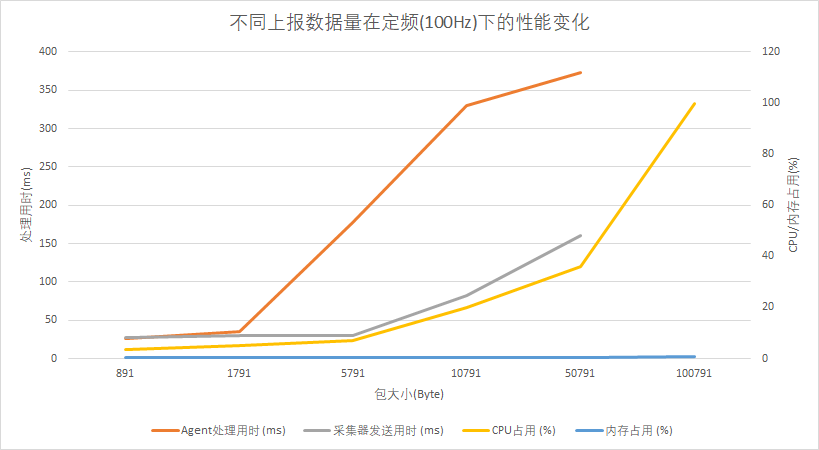
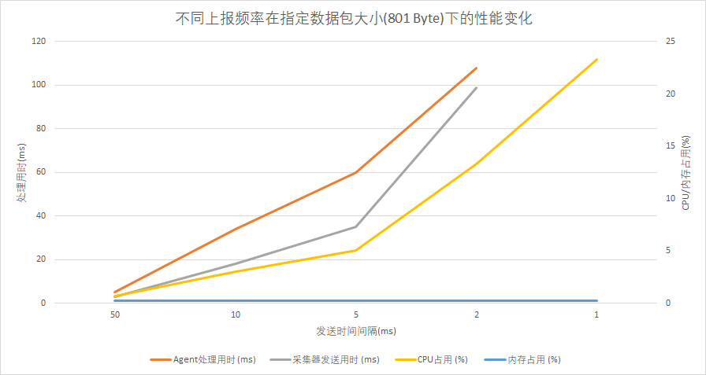

## 测试目的

1. 测试重构后的采集器架构各项功能是否保持可用
2. 测试极限环境下采集器是否可用
3. 测试采集器可用的极限


## 测试环境说明

### Windows 环境

#### CPU

型号：Intel(R) Core(TM) i7-7700

处理器数量：8

总线程数：16

频率：3.60 GHz

缓存：8 MB

#### Memory

总大小：16 GB

频率：2400 MHz

#### System

系统版本：Windows 10 专业版 1709

OS 内部版本：16299.1087


### Linux 环境

#### CPU

型号：Intel(R) Xeon(R) X3440

处理器数量：8

总线程数：16

频率：2.53 GHz

缓存：8 MB

#### Memory

总大小：8 GB

频率：1333 MHz

#### System

内核版本：2.6.32.43-tlinux-1.0.10-default

系统版本：CentOS 6.2 (Final)


## 功能测试

### 创建采集器

*测试环境：Linux & Windows*

| 测试项                       | 应有表现                                    | 是否通过                      |
| ---------------------------- | ------------------------------------------- | ----------------------------- |
| 不指定配置文件开启           | 默认使用当前文件夹下的采集器同名配置文件    | <font color=green>pass</font> |
| 指定配置文件开启             | 解析指定的配置文件                          | <font color=green>pass</font> |
| 重复启动同路径的同一个采集器 | 无法启动，报pid文件正在被其他进程上锁的错误 | <font color=green>pass</font> |
| 配置文件格式或数据类型不匹配 | 无法启动，报配置相关错误                    | <font color=green>pass</font> |
| 指定上报数据处理附加配置启动 | 启动成功，附加配置生效                      | <font color=green>pass</font> |


### 发送采集数据

*测试环境：Linux & Windows*

| 测试项                     | 应有表现  | 是否通过                      |
| -------------------------- | --------- | ----------------------------- |
| 初始化采集器成功后调用Send | 正常发送  | <font color=green>pass</font> |
| 未初始化采集器调用Send     | 返回false | <font color=green>pass</font> |
| 采集器停止后调用Send       | 返回false | <font color=green>pass</font> |

#### 发送数据格式差异记录

**缺少项**

1. `beat.address` 存放采集器所在机器的ip地址

**修改项**

1. `beat.hostname`, `beat.name` 两者存放的都是主机名，被修改为 `agent.hostname`, `host.name`
2. `beat.version` 存放采集器的版本，被修改为 `agent.version`

**新增项**

1. `ecs` 存放Elastic Common Schema的版本信息等数据，ECS是Elasticsearch规定的存储事件数据时使用的字段规范
2. `ecs.version` 存放ECS版本信息
3. `agent.id` 存放采集器运行环境的唯一识别码，对应采集器运行的机器
4. `agent.type` 存放采集器的名称
5. `agent.ephemeral_id` 存放采集器实例的唯一识别码

**实例对比**

旧版本

```json
{
    "beat":{
        "address":[
            "fe80::c8b8:cbe1:be5b:7ba0",
            "169.254.123.160",
            "172.27.212.49",
            "fe80::15c1:1674:ace0:7f4b",
            "10.6.51.53",
            "fe80::c4d8:ef63:e914:ad5b",
            "172.30.64.1"
        ],
        "hostname":"archieai-PC2",
        "name":"archieai-PC2",
        "version":"V1.0"
    },
    "bizid":1,
    "cloudid":2,
    "dataid":1430,
    "gseindex":1,
    "ip":"10.0.0.1",
    "time":"2019-08-01 15:15:04"
}
```

新版本

```json
{
    "agent":{
        "ephemeral_id":"a847dd05-f240-41cf-aa07-675ba47180a8",
        "hostname":"archieai-PC2",
        "id":"fbeb7fc6-9e9b-44b5-8062-1e61991d29f0",
        "type":"basictestbeat",
        "version":"v1.0"
    },
    "bizid":1,
    "cloudid":2,
    "dataid":1230,
    "ecs":{
        "version":"1.0.0"
    },
    "gseindex":1,
    "host":{
        "name":"archieai-PC2"
    },
    "ip":"10.0.0.1",
    "time":"2019-08-01 15:41:55"
}
```


### 获取采集器配置

*测试环境：Linux & Windows*

| 测试项                          | 应有表现            | 是否通过                      |
| ------------------------------- | ------------------- | ----------------------------- |
| 初始化采集器成功后调用GetConfig | 返回`config`与`nil` | <font color=green>pass</font> |
| 未初始化采集器调用GetConfig     | 返回`nil`与`error`  | <font color=green>pass</font> |
| 采集器停止后调用GetConfig       | 返回`nil`与`error`  | <font color=green>pass</font> |


### 停止采集器

*测试环境：Linux & Windows*

| 测试项                                 | 应有表现                                            | 是否通过                      |
| -------------------------------------- | --------------------------------------------------- | ----------------------------- |
| 采集器初始化后（也即运行中时）调用Stop | 返回`nil`                                           | <font color=green>pass</font> |
| 采集器未初始化时调用Stop               | 返回`error`                                         | <font color=green>pass</font> |
| 采集器停止后调用Stop                   | 返回`error`                                         | <font color=green>pass</font> |
| 采集器被动停止（SIGINT等信号）         | 关闭`beat.Done`通道告知开发者结束采集，程序正常结束 | <font color=green>pass</font> |


### console输出

*测试环境：Linux & Windows*

console输出功能正常


### gse输出

*测试环境：Linux & Windows*

| 测试项                               | 应有表现                              | 是否通过                      |
| ------------------------------------ | ------------------------------------- | ----------------------------- |
| 采集器初始化后（也即运行时）调用Send | 正常通信                              | <font color=green>pass</font> |
| agent未开启                          | 多次重试连接失败后自动结束，返回`err` | <font color=green>pass</font> |
| 指定错误的agent监听地址              | 多次重试连接失败后自动结束，返回`err` | <font color=green>pass</font> |
| agent重启                            | 尝试重连并成功连接                    | <font color=green>pass</font> |


### bkpipe输出

*测试环境：Linux  & Windows*

bkpipe与gse代码相同，表现相同


### monitor数据质量监控

*测试环境：Linux & Windows*

monitor功能正常


### resource采集器资源占用监控

*测试环境：Linux & Windows*

resource功能正常


### stat运营数据监控

*测试环境：Linux & Windows*

stat功能正常


## 性能测试

### 资源占用对比测试

*测试环境：Linux*

通过更改**basereport**上报数据的频率，在采集器成功开启并发送第一条数据后，观察10秒钟，每秒刷新一次cpu占用率，统计结果如下（单位 %）：



并且根据观察，在所有的上报频率下，内存占用率都稳定在0.2%。

从结果中可以看出，新旧版本的采集器资源占用基本无差别。


### 压力测试

*测试环境：Linux*

通过指定发送数据大小（或发送时间间隔），修改发送时间间隔（或数据大小），得到如下表格，并记录问题

**设置时间间隔为10ms（即每秒发送100次）**

| 包大小 (Byte)                  | 891  | 1791 | 5791 | 10791 | 50791 | 100791 | 500791 |
| ------------------------------ | ---- | ---- | ---- | ----- | ----- | ------ | ------ |
| Agent处理100条数据总用时 (ms)  | 25   | 26   | 35   | 178   | 330   | 373    |        |
| 采集器发送100条数据总用时 (ms) | 5    | 27   | 30   | 30    | 82    | 160    |        |
| CPU占用 (%)                    | 3.3  | 3.7  | 5    | 7     | 20    | 36     | 99.9   |
| 内存占用 (%)                   | 0.2  | 0.2  | 0.2  | 0.2   | 0.3   | 0.3    | 0.6    |





| 包大小 (Byte) | 500791                                                       |
| ------------- | ------------------------------------------------------------ |
| 问题          | 上报每个数据包需要约30ms（统计数据，图表中未体现），数据上报的速度达到了瓶颈（此时上报速度约为16MB/s） |


**设置发送数据包大小为801 Byte**

| 间隔时间 (ms)       | 50   | 10   | 5                                | 2                                | 1                                 |
| ------------------- | ---- | ---- | -------------------------------- | -------------------------------- | --------------------------------- |
| Agent处理用时 (ms)  | 5    | 34   | 60                               | 108                              |                                   |
| 采集器发送用时 (ms) | 3    | 18   | 35                               | 99                               |                                   |
| CPU占用 (%)         | 0.7  | 3    | 5                                | 13.3                             | 23.3                              |
| 内存占用 (%)        | 0.2  | 0.2  | 0.2                              | 0.2                              | 0.2                               |



| 间隔时间 (ms) | 5                                | 2                                | 1                                 |
| ------------- | -------------------------------- | -------------------------------- | --------------------------------- |
| 问题          | 每秒只发送了约195个数据，不足200 | 每秒只发送了约450个数据，不足500 | 每秒只发送了约820个数据，不足1000 |

*\*经过对比，旧版本的采集器在发送周期小于10ms时也会出现发送包的数量不足的情况，原因可能是因为计时器精度不够*


## 总结

1. 在Linux和Windows平台下，各项功能都**可用**。
2. 上报频率**大于100 Hz**时，由于时钟精度等问题，可能造成上报包数不足的情况。
3. 在达到测试机配置的基础上，上报数据包大小（）与上报频率（）建议满足关系：，以保证采集器的资源占用率正常。
4. 目前采集器没有对上报数据流量做限制。