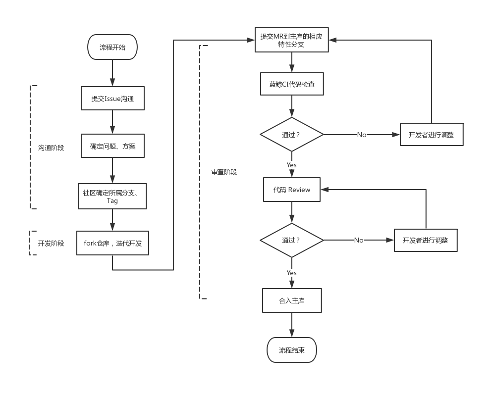
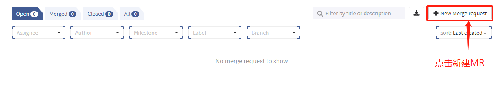
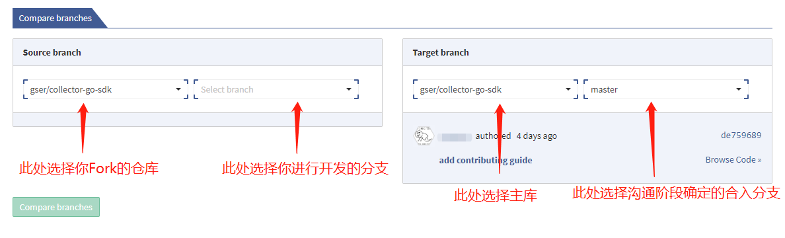

# 社区贡献

## 流程总览

参与社区贡献共分为三个阶段，按照时间顺序分别为**沟通阶段**、**开发阶段**与**审查阶段**。具体流程如下图所示

## 沟通阶段

在这个阶段，你可以将自己发现的问题，或是需求、功能优化的想法提出来与社区参与者沟通，明确问题并确认代码开发方案。当开发方案确定并被接受后，社区会确定该问题、需求所属的分支或 Tag ，你便可以 Fork 代码并 checkout 到相应的分支或 Tag 进行开发工作。

- 提交 issue

Issue 是参与社区贡献或与社区交流的入口。通过提交 issue，将你的问题或需求按照模板详细描述，让社区其他开发者明白你的问题或需求，与社区的参与者进行初步沟通。

提交 issue 入口：[点此新建 issue](https://github.com/TencentBlueKing/collector-go-sdk/issues)

模板：[Bug模板](issue格式-Bug.md)、[需求模板](issue格式-需求.md)

- 确定方案

在你提的 issue 中详尽地阐述问题与需求，并且与社区开发者们达成共识，形成方案记录于 issue 中。方案应包含代码设计、接口变更等内容，这是后续开发者参与到开发过程中的重要基础，也是管理员进行最后的代码审查的重要依据。当方案在社区中达到了共识，就可以进行后续的开发工作了。

- 确定合入分支

当方案确定并被审核通过后，社区管理员会确认问题或需求对应的分支或 Tag，如有需要管理员会开辟一个新的 feature 分支来作为该 issue 的合入分支。拿到对应的开发分支后，就可以进行后续的开发阶段了。

## 开发阶段

完成了社区讨论阶段并达成了一致的意见后，便可以进行功能的开发了。

首先，在 gser/collector-go-sdk 的主页将仓库代码 **Fork** 到自己的仓库中进行开发，保持主库代码可控。

Fork 完成后，clone 你仓库中的 collector-go-sdk 项目到本地，并 checkout 到对应的分支或 Tag，根据前文确定的开发方案进行开发。在开发过程中，可以将较大的目标进行拆解，分多个 commit 多次提交。

## 审查阶段

为了保持主库代码的质量以及代码合规，你所提交的代码需要经过社区的审查才可以被合入主库。

- 提交MR

首先，进入Merge Requests 界面，点击 New Merge request 按钮创建一个新的 MR。

在新的界面中，选择你 fork 的库中进行开发的分支为 Source branch ，选择主库中为你分配的开发分支为 Target branch，点击 Compare branch 按钮创建 MR。

为了方便社区对你的 MR 进行审查，请按照 [MR模板](MR模板.md) 填写相应的信息。信息填写完整后，点击 Submit merge request 就完成了提交 MR 的所有过程，等待社区对代码提出修改意见或合入主库。

- 代码检查

完成 MR 的提交后，会自动触发 蓝鲸CI 流程，对提供的代码进行代码检查、单元测试、集成测试等操作。

代码检查包括代码敏感信息检查与 examplebeat 编译检查，保证代码的风险可控，并且保证主库代码的**最低**要求——可编译。框架的单元测试与集成测试还在筹备阶段，将来将会整合入代码检查流水线，提供全面的自动化的代码检查与测试。

在这些检查通过后，社区会开始对你的代码发起评审。

- 代码评审

社区会在 MR 下针对改动代码提出代码修改意见，请在 source branch 中修改代码并 commit 提交，提交后改动会自动同步到 MR 中。待社区达成一致意见后，你的 MR 将会被 Merge 进入主库中。这样，一次代码的贡献就结束了。感谢你为社区做出的贡献。