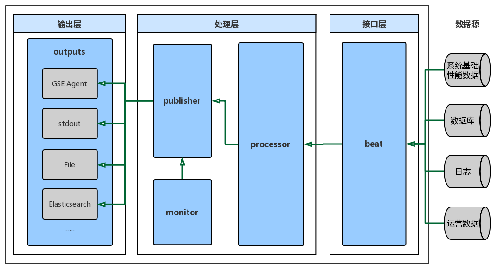
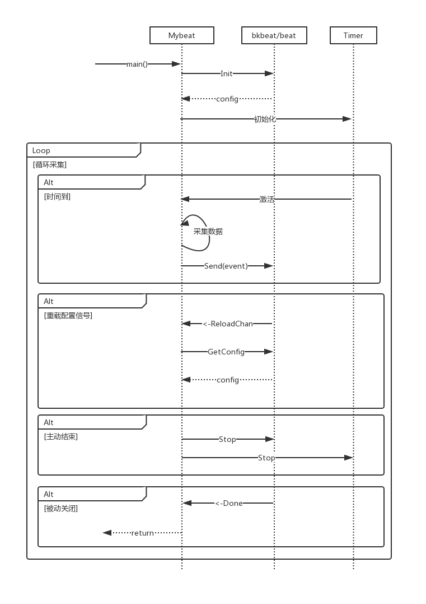

# 采集器框架使用文档

## 目录

- [采集器框架简介](#采集器框架简介)
    - [功能简介](#功能简介)
    - [采集器框架架构](#采集器框架架构)
    - [采集器框架工作原理](#采集器框架工作原理)
- [功能特性](#功能特性)
    - [日志模块](#日志模块)
    - [数据质量监控](#数据质量监控)
    - [资源占用监控](#资源占用监控)
    - [运营数据上报](#运营数据上报)
- [使用说明](#使用说明)
    - [采集器快速开发示例](#采集器快速开发示例)
    - [数据结构与接口](#数据结构与接口)
    - [详细配置说明](#详细配置说明)


## 采集器框架简介

### 功能简介

蓝鲸采集器框架是基于libbeat开源框架基础上的二次开发，主要对主机，互联网设备，服务应用等进行数据采集，上报的组件。例如采集 主机/容器 的数据，包括系统基础性能、应用服务、数据库、日志等，通过蓝鲸管控平台 (GSE) 的数据管道，将数据传输到蓝鲸数据平台，进行分析计算，监控及告警等。此外，蓝鲸采集器框架还支持**配置热重载**、**PID文件**、**本地存储**、**数据质量监控**、**资源占用监控**、**运营数据上报**等功能。


### 采集器框架结构



蓝鲸采集器框架设计，整体分为以下三层：
1. **接口层**：提供初始化、发送等接口，接收来自不同数据源的数据。
2. **处理层**：接收来自接口层的数据，通过过滤、打包、监控打点等操作对数据进行加工处理。
3. **输出层**：经处理层处理后的数据，会通过输出层，输出到具体的输出通道上，如GSE Agent、标准输出、文件和Elastic Search等。

在代码目录方面，包含以下包：

| 包               | 功能                                                         |
| :--------------- | :----------------------------------------------------------- |
| bkbeat/beat             | 提供了管理采集器生命周期的方法，提供了创建采集器需要用到的方法，以及在采集数据、发送数据的循环周期中需要用到的数据结构 |
| bkbeat/logp | 日志模块，提供打印各种级别日志的方法 |
| bkbeat/bkprocessor      | 在数据被传输前，对满足一些特定条件的数据进行预处理。内含一个预处理模块：set_dataid，通过配置文件加载 |
| bkbeat/bkoutput        | 蓝鲸采集器所使用的输出模块gse与bkpipe，通过配置文件加载 |
| bkbeat/common        | 采集器框架用到的公共库       |
| bkbeat/gselib | 提供与gse output有关的基础功能，为bkoutput服务 |
| bkbeat/pidfile          | 保存采集器的pid，可被agent监控；防止在同一个位置开启多个采集器；windows环境下作为reload管道名称的一部分 |
| bkbeat/reloader | 配置热加载的基础功能库                          |
| bkbeat/storage          | 提供本地数据存储的方法        |
| bkbeat/monitor          | 埋点数据，提供数据质量监控使用                               |
| bkdatalib/docker           | 提供容器信息采集方法的包                                     |
| bkdatalib/stat             | 周期性发送运营数据                             |
| bkdatalib/system | 封装了不同操作系统的socket、disk相关接口，提供与操作系统无关的函数调用 |
| libbeat/cfgfile | 与现有的部分采集器兼容，暂时保留 |
| libbeat/common | 与现有的部分采集器兼容，暂时保留，MapStr等常用数据结构请使用bkbeat/beat包 |
| libbeat/outputs | 与现有的部分采集器兼容，暂时保留 |
| libbeat/paths | 与现有的部分采集器兼容，暂时保留 |
| libbeat/plugins | 与现有的部分采集器兼容，暂时保留 |


### 采集器框架工作原理



- 调用beat.Init(beatName, version)初始化采集器，函数返回采集器配置信息
- 采集器根据需要解析配置，设定Timer的周期进行循环采集数据
- 采集器调用beat.Send(event)函数发送采集数据
- 采集器在接收到<-beat.ReloadChan传输的信号后主动获取重载后的配置信息并解析配置
- 采集器在需要时，调用beat.Stop()结束采集器的生命周期
- 采集器接收到<-beat.Done的信号说明采集器被外部因素关闭，需要结束任务


## 功能特性

### 日志模块

**使用方法**

```go
//前代版本
logp.Debug("sector", "format", vals)
logp.Info("format", vals)
logp.Warn("format", vals)
logp.Err("format", vals)
logp.Critical("format", vals)

//当前版本
logp.L.Named("sector").Debugf("format", vals)
logp.L.Infof("format", vals)
logp.L.Warnf("format", vals)
logp.L.Errorf("format", vals)
logp.L.Fatalf("format", vals)
```

**注意事项**

必须在采集器启动，也即调用`beat.Init()`无报错后才可以使用日志模块，否则会出现错误


### 数据质量监控

**作用**


对采集数据的发送情况进行统计监控，并上报。上报时间间隔是1分钟。

**使用方法**


使用gse作为输出，默认开启该功能，dataid为295，也可以在gse的配置中指定monitorid


### 资源占用监控

**作用**


对采集器使用的系统资源进行监控并上报，上报时间间隔是1分钟。

**使用方法**


使用gse作为输出，默认不开启，在gse的配置中指定大于0的resourceid则可开启资源使用上报模块


### 运营数据上报

**作用**


周期性发送运营数据，包含采集器名称、版本、时间以及附属信息，附属信息需要用户实现GetStat函数

**使用方法**

1. 实现GetStat函数

```go
type GetStat func() beat.MapStr
```
2. 实例化运营数据上报模块

```go
stat, err := stat.NewCycleStat(beatName, GetStat, beat.Send)
```

3. 开启运营数据上报模块

```go
stat.Run()
```


## 使用说明

### 采集器快速开发示例

#### 推荐工程目录结构

导出采集器框架代码后，将采集器框架（collector-go-sdk）置于你的采集器项目的./vendor/gser文件夹下，项目结构如下所示：

```
<examplebeat>
    ├─examplebeat.yml    采集器的配置文件
    ├─main.go            采集器主体（需自行实现采集逻辑，调用采集器框架提供的
    │                    方法启动、发送信息和关闭采集器）
    └─<config>
    │    └─config.go     自定义的配置类，后续通过unpack方法，
    │                    将配置文件中对应的配置加载进Config实例中
    └─<vendor>
        └─<gser>
            └─<collector-go-sdk>    采集器框架置于此目录
```

#### 代码示例

使用采集器框架提供的接口`Init`, `Send`实现简单的采集器

```go
import (
    "fmt"

    "gser/collector-go-sdk/beats/bkbeat/beat"
    "gser/collector-go-sdk/beats/bkbeat/logp"
)

func main() {
    beatname := "examplebeat"
    version := "V1.0"
    var err error

    // 调用Init函数开启采集器，获取采集器配置
    _, err = beat.Init(beatname, version)
    if err != nil {
        fmt.Println(err.Error())
        return
    }
    // 日志输出
    logp.L.Infof("%s started.", beatname)

    // 待发送的采集数据
    event := beat.MapStr{
        "msg": "hello world",
    }
    // 调用Send函数发送采集数据
    beat.Send(event)

    // 调用Stop结束采集器的生命周期
    beat.Stop()
}

```


#### 为采集器添加配置

对于一些可能会根据实际情况变化的变量，例如上报数据周期，无法在编译时确定其具体的值，需要使采集器在运行时从外界获取配置

采集器框架统一使用yaml文件对采集器进行配置。yaml文件的格式为

```yaml
# 简单键值对
fields1: "data"

# 值嵌套一
fields2:
  fields3: 233

# 值嵌套二
fields4.fields5: 666
```

采集器框架将yaml文件中键为采集器名称（如上例的examplebeat）的值作为开发者可自定义的配置项。开发者可以自定义自己的struct，并且为每一个数据项添加tag，tag的内容`config:"fieldname"`。其中`fieldname`即对应yaml文件中的键名。指定数据项的tag为`config:",ignore"`指示该数据项在配置文件中没有对应的配置，无需解析

##### 配置类示例

```go
// 文件位置：examplebeat/config/config.go

package config

import (
    "time"
)

type Config struct {
    DataID   int32         `config:"dataid"`    /* 在配置文件中是
                                                ** examplebeat.dataid
                                                */
    Interval time.Duration `config:"interval"`  /* 在配置文件中是
                                                ** examplebeat.interval
                                                */
}

//如果配置文件没有设置相关内容，则使用默认配置
var DefaultConfig = Config{
    DataID:   0,
    Interval: time.Minute,
}

```

##### 配置文件示例

详细的配置说明，请参阅 [采集器框架配置说明](#%E8%AF%A6%E7%BB%86%E9%85%8D%E7%BD%AE%E8%AF%B4%E6%98%8E)

```yaml
# 文件位置：examplebeat/examplebeat.yml
#============================== examplebeat ===========================
# need a beatname namespace
examplebeat:
  dataid: 1430
  interval: 1s

#================================ Outputs ==============================
# Configure what outputs to use when sending the data collected by the beat.
# Multiple outputs may be used.
output.console:
```

##### 带有配置的代码示例

`Init`, `GetConfig`将会获取配置文件中用户自定义的配置信息，使用配置信息的`Unpack`函数将配置信息解析到开发者自定义的配置struct中

```go
// 文件位置：examplebeat/main.go

package main

import (
    "fmt"
    "os"
    "os/signal"
    "syscall"
    "time"

    // 采集器功能相关
    "gser/collector-go-sdk/beats/bkbeat/beat"
    // 日志功能相关
    "gser/collector-go-sdk/beats/bkbeat/logp"
    // 自定义配置类
    "examplebeat/config"
)

func main() {
    beatname := "examplebeat"
    version := "V1.0"
    var err error
    var localconfig *beat.Config

    // 调用Init函数开启采集器，获取采集器配置
    localconfig, err = beat.Init(beatname, version)
    if err != nil {
        fmt.Println(err.Error())
        os.Exit(1)
    }
    logp.L.Infof("%s started.", beatname)
    
    // 解析配置
    cfg := config.DefaultConfig
    err = localconfig.Unpack(&cfg)
    
    //设计采集数据时间间隔
    timer := time.NewTimer(cfg.Interval)
    done := make(chan bool)
    
    // 开始循环采集
    for {
        select {
        // 计时器信号
        case <-timer.C:
            // 待发送的采集数据
            event := beat.MapStr{
                "dataid": cfg.DataID,
                "msg":    "hello world",
            }
            // 调用Send函数发送采集数据
            beat.Send(event)
            logp.L.Infof("%s sent a msg.", beatname)
            timer.Reset(cfg.Interval)
        // 采集器结束信号
        case <-beat.Done:
            // 停止采集器
            return
        // 采集器热加载配置信号
        case <-beat.ReloadChan:
            // 调用GetConfig函数获取新的配置
            localconfig = beat.GetConfig()
            // 解析配置
            cfg = config.DefaultConfig
            err = localconfig.Unpack(&cfg)
            timer.Reset(cfg.Interval)
        }
    }
}
```

#### 构建

转到exampleBeat项目文件夹，执行命令

```powershell
go build
```

#### 运行

运行

```bash
./examplebeat -c examplebeat.yml
```

热加载配置

```bash
./examplebeat -reload -c examplebeat.yml
```


### 数据结构与接口

#### 数据结构

包名：collector-go-sdk/beats/bkbeat/beat

- 类型名：`Config`

  - 成员函数（以类指针形式调用）

    | 函数名 | 传入参数             | 返回值  | 作用                                                         |
    | ------ | -------------------- | ------- | ------------------------------------------------------------ |
    | Unpack | config `*YourConfig` | `error` | 解析配置<br>传入自定义的配置类指针，根据自定义配置类中各项的tag进行反射，提取配置文件中相应的值<br>如果配置文件中不存在某项，则配置类中该项的值不会被更改<br>error为空指针表示解析成功，否则表示解析失败 |

- 类型名：`MapStr`

  - 上报数据的最小单元，可直接使用beat.Send()上报
  
- 类型名：`Event`

  ```go
  // 上报数据的基本单元，beat.Send()接受的MapStr将会作为Fields字段的值
  // 如需指定附加值，则使用Event类型通过beat.SendEvent()上报
  type Event struct {
      Timestamp time.Time
      Meta      MapStr
      Fields    MapStr
      Private   interface{} // 不会被上报，仅做event监控或状态相关用途
  }
  ```

- 类型名：`PublishConfig`

  ```go
  // 配置数据上报的附加功能（上报数据模式、信息统计、数据预处理等内容）
  type PublishConfig struct {
      // 共三种模式：
      // 0表示不进行设置
      // 1表示发送不成功时反复重试直到成功发送
      // 2表示当数据处理pipeline满时丢弃后续上报的数据
      PublishMode PublishMode
  
      // 数据预处理
      Processing ProcessingConfig
  
      // WaitClose sets the maximum duration to wait on ACK, if client still has events
      // active non-acknowledged events in the publisher pipeline.
      // WaitClose is only effective if one of ACKCount, ACKEvents and ACKLastEvents
      // is configured
      WaitClose time.Duration
  
      // Events configures callbacks for common client callbacks
      Events ClientEventer
  
      // ACK handler strategies.
      // Note: ack handlers are run in another go-routine owned by the publisher pipeline.
      //       They should not block for to long, to not block the internal buffers for
      //       too long (buffers can only be freed after ACK has been processed).
      // Note: It's not supported to configure multiple ack handler types. Use at
      //       most one.
  
      // ACKCount reports the number of published events recently acknowledged
      // by the pipeline.
      ACKCount func(int)
  
      // ACKEvents reports the events private data of recently acknowledged events.
      // Note: The slice passed must be copied if the events are to be processed
      //       after the handler returns.
      ACKEvents func([]interface{})
  
      // ACKLastEvent reports the last ACKed event out of a batch of ACKed events only.
      // Only the events 'Private' field will be reported.
      ACKLastEvent func(interface{})
  }
  ```

#### 函数

包名：collector-go-sdk/beats/bkbeat/beat

| 函数名                  | 传入参数                                                     | 返回值             | 作用                                                         |
| ----------------------- | ------------------------------------------------------------ | ------------------ | ------------------------------------------------------------ |
| `Init`                  | beatName `string`, version `string`                          | `*Config`, `error` | 初始化采集器<br>输入采集器的名字、版本，返回采集器的配置和错误。error为空指针则说明初始化成功 |
| `InitWithPublishConfig` | beatName `string`, version `string`, pubConfig `PublishConfig` | `*Config`, `error` | 初始化采集器<br/>输入采集器的名字、版本与数据处理附加配置，返回采集器的配置和错误。error为空指针则说明初始化成功 |
| `Send`                  | event `MapStr`                                               | `bool`             | 发送采集数据（以MapStr格式）<br>返回值为true表示发送成功，返回值为false表示发送失败 |
| `SendEvent`             | event `Event`                                                | `bool`             | 发送采集数据（以Event格式）<br/>返回值为true表示发送成功，返回值为false表示发送失败 |
| `GetConfig`             | 空                                                           | `*Config`          | 获取采集器配置<br>在reload时获取配置时使用，返回最新版本的配置文件中与采集器相关的配置。如果返回空指针则表示解析配置文件失败 |
| `Stop`                  | 空                                                           | `error`            | 停止采集器<br>停止采集器的生命周期，如果需要再次开启需要再次调用Init函数。error为空指针则说明停止成功 |

包名：collector-go-sdk/beats/bkbeat/logp

| 函数名                     | 传入参数                                                   | 返回值 | 作用                                                         |
| -------------------------- | ---------------------------------------------------------- | ------ | ------------------------------------------------------------ |
| `L.Infof`                  | format `string`, vals `...intrerface{}`                    | 空     | 输出Info级别日志，用法与fmt.Printf相同                       |
| `L.Named(selector).Debugf` | selector `string`, format `string`, vals `...intrerface{}` | 空     | 输出Debug级别日志，其中Named的参数为Debug筛选器名称。        |
| `L.Warnf`                  | format `string`, vals `...intrerface{}`                    | 空     | 输出Warn级别日志，用法与fmt.Printf相同                       |
| `L.Errorf`                 | format `string`, vals `...intrerface{}`                    | 空     | 输出Error级别日志，用法与fmt.Printf相同                      |
| `L.Fatalf`                 | format `string`, vals `...intrerface{}`                    | 空     | 输出Fatal Error（同Critical Error）级别日志，用法与fmt.Printf相同 |


#### 信号

| 信号名     | 类型        | 含义                                                         |
| ---------- | ----------- | ------------------------------------------------------------ |
| ReloadChan | `chan bool` | 当ReloadChan有数据写入时，表示需要进行配置重载，使用GetConfig重新获取配置并解析 |
| Done       | `chan bool` | 当Done被关闭时，表示采集器因为外部原因（SIGINT信号等）终止了工作，需要开发者自行退出采集循环 |


### 详细配置说明

#### 总览

配置文件格式：yaml

可配置项：

| 配置项名称 | 信息                       |
| ---------- | -------------------------- |
| {beatname} | 自定义的配置信息           |
| output     | 采集数据输出方法的配置     |
| path       | 采集器的目录相关配置       |
| logging    | 采集器的日志模块相关配置   |
| processors | 采集器的采集数据预处理配置 |

配置示例：

```yaml
# ==================自定义配置信息==================
# 此项为自定义项，需要自行实现配置类，
# 见上文采集器快速开发示例一节
examplebeat:
  dataid: 1430
  interval: 1s

# ===================输出方式配置===================
# 向 GSE Agent 输出
output.gse:
  endpoint: "/usr/local/gse/gseagent/ipc.state.report"
  endpoint: "127.0.0.1:47000"
  retrytimes: 5
  retryinterval: 5s
  mqsize: 2
  writetimeout: 3s
  monitorid: 295
  resourceid: 233
# 或 使用命令行输出
# output.console:
#   pretty: true
#   enabled: true
#   bulk_max_size: 2048
#   codec.format:
#     json.escape_html: false

# =====================路径配置=====================
path:
  config: /usr/local/gse/plugins/etc
  logs: /var/log/gse
  data: /var/lib/gse
  pid: /var/run/gse

# =====================日志配置=====================
logging.level: error
logging.to_files: true
logging.to_syslog: false
logging.files:
  path: /var/log/mybeat
  name: mybeat.log
  keepfiles: 7

# ===================数据处理配置===================
processors:
 - <processor_name>:
     when:
        <condition>
     <parameters>
 - <processor_name>:
     when:
        <condition>
     <parameters>
```


#### Beater

有关采集逻辑的基础配置，例如采集时间间隔、采集器数据id，开发者自行定义

Example：

```go
examplebeat:    //必须以采集器的名称命名
  dataid: 1430
  interval: 1s
```


#### Output

有关采集数据输出方法的配置

共有2种Output模型：

```yaml
output.gse
output.console
```

**output.gse**

配置详情

| 字段          | 类型           | 必填 | 默认值 | 单位 | 描述                                                         |
| ------------- | -------------- | ---- | ------ | ---- | ------------------------------------------------------------ |
| endpoint      | string         | 是   |        |      | gse agent监听的端点                                          |
| retrytimes    | unsigned int   | 否   | 3      | 次   | 与gse agent尝试重连的最大次数                                |
| retryinterval | time.Duration  | 否   | 3      | 秒   | 与gse agent两次重连之间的时间间隔                            |
| mqsize        | unsigned int32 | 否   | 1      | 个   | 发送数据channel的缓存大小，当发送数据的数量达到缓存则会阻塞channel的写操作 |
| writetimeout  | time.Duration  | 否   | 5      | 秒   | 写数据超时，如果超时直接中止当前传输任务并返回错误           |
| monitorid     | int32          | 否   | 295    |      | 数据质量监控的dataid                                         |
| resourceid    | int32          | 否   | 0      |      | 资源占用监控的dataid                                         |

配置示例

```yaml
output.gse:
  # linux agent ipc file config
  endpoint: "/usr/local/gse/gseagent/ipc.state.report"
  # windows agent socket config
  endpoint: "127.0.0.1:47000"
  # 断线重连
  retrytimes: 5
  retryinterval: 5s
  mqsize: 2
  # 秒为单位
  writetimeout: 3s
  # 监控gse采集数据上报质量，默认295
  monitorid: 295
  # 监控采集器资源使用情况（cpu, mem, fd）
  resourceid: 233
```


**output.console**

配置详情

| 字段          | 类型   | 必填 | 默认值 | 单位 | 描述                                                         |
| ------------- | ------ | ---- | ------ | ---- | ------------------------------------------------------------ |
| pretty        | bool   | 否   | false  |      | 是否格式化json输出，值为false则不格式化，值为true则格式化，默认为false |
| enabled       | bool   | 否   | true   |      | 是否打开命令行输出，默认为true                               |
| bulk_max_size | int32  | 否   | 2048   | 个   | 输出缓存，表示为events在输出前可以被缓存的个数               |
| **codec**     | object | 否   |        |      | 指示数据应该以何种方式被格式化，默认以pretty约束的json格式输出 |

**codec**

| 字段       | 类型   | 必填 | 描述                     |
| ---------- | ------ | ---- | ------------------------ |
| **json**   | object | 否   | 以json格式格式化输出     |
| **format** | object | 否   | 以自定义的格式格式化输出 |

**json**

| 字段        | 类型 | 必填 | 默认值 | 描述                         |
| ----------- | ---- | ---- | ------ | ---------------------------- |
| pretty      | bool | 否   | false  | 是否格式化json数据           |
| escape_html | bool | 否   | false  | 是否跳过json数据中的html符号 |

**format**

| 字段   | 类型   | 必填                         | 描述         |
| ------ | ------ | ---------------------------- | ------------ |
| string | string | 是（如果声明了其父命名空间） | 格式化字符串 |


配置示例

```yaml
output.console:
  # 自定义格式
  codec.format:
    string: '%{[@timestamp]} %{[message]}'
```


#### Path

有关采集器的目录配置

**path**

配置详情

| 字段   | 类型 | 必填 | 默认值             | 描述                   |
| ------ | ---- | ---- | ------------------ | ---------------------- |
| home   | path | 否   | 二进制文件所在目录 | 采集器主目录           |
| pid    | path | 否   | $home              | pid文件所在目录        |
| config | path | 否   | $home              | 采集器配置文件所在目录 |
| data   | path | 否   | $home/data         | 采集器数据存放目录     |
| logs   | path | 否   | $home/logs         | 采集器日志存放记录     |

配置示例

```yaml
path:
  home: /usr/share/beats
  config: /usr/share/beats/config
  logs: /var/log/beats
  data: /var/lib/beats
  pid: /var/pid
```


#### Logging

有关日志输出的配置，例如日志输出的类别（debug，info，warning，error，critical error），是否保存到文件等等配置。默认为输出info及其以上级别的日志。具体内容详见 [collector-go-sdk/beats/vendor/github.com/elastic/beats/libbeat/docs/loggingconfig.asciidoc](../vendor/github.com/elastic/beats/libbeat/docs/loggingconfig.asciidoc)

配置示例

```yaml
logging.level: debug
logging.to_files: true
logging.to_syslog: false
logging.files:
  path: /var/log/mybeat
  name: mybeat.log
  keepfiles: 7
```


#### Processors

Processors用于在发送采集信息前对采集信息进行预处理。Processors的配置方法如下：

```yaml
# - <processor_name>:
#     when:
#        <condition>
#     <parameters>

processors:
 - add_fields:
     target: project
     fields:
       name: myproject
       id: '574734885120952459'
 - drop_event:
     when:
       equals:
         dataid: -1
...
```

与Processor相关的预处理工具的作用，详见 [collector-go-sdk/beats/vendor/github.com/elastic/beats/libbeat/docs/processors-using.asciidoc](../vendor/github.com/elastic/beats/libbeat/docs/processors-using.asciidoc)